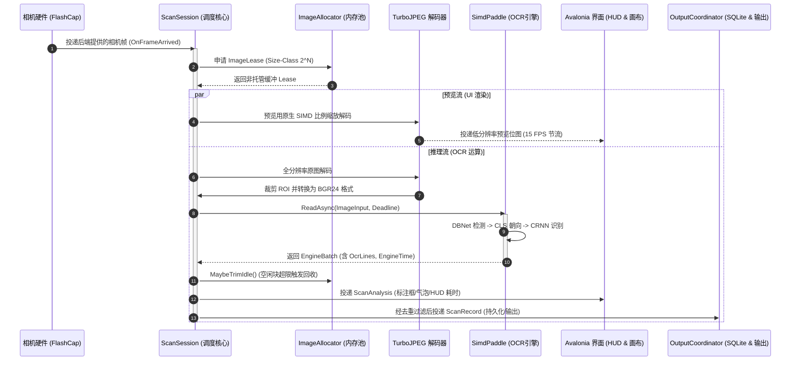

# ScanFlow-OCR 项目架构与实现边界说明

本文档说明 **ScanFlow-OCR**（单 OCR 视觉识别系统）的技术定位、核心流水线、图像缓冲区治理、几何朝向解算、输出队列及 UI 呈现架构。文中将已由源码确认的实现与需要在目标设备验证的性能/可靠性结论分开描述。

---

## 1. 架构定位与设计哲学

### 1.1 项目定位与应用场景

**ScanFlow-OCR** 面向工控质检、物流单据核对及桌面自动化录入场景，提供连续相机帧与静态图像中的文字检测和字符识别。系统在一个 Avalonia 进程内组织采集、解码、OCR、UI 和输出模块；吞吐、延迟、内存和识别率需要结合模型、相机、驱动与目标设备实测。

| 维度 | 设计指标与实现方案 |
| :--- | :--- |
| **算法范式** | **纯进程内深度学习 OCR**：文本行检测 (DBNet) + 文本行朝向分类 (CLS) + 字符序列识别 (CRNN/SVTR) |
| **进程模型** | **单进程直调**：算法、图像缓冲、视频解码和桌面 UI 在同一进程中协作，不需要跨进程 IPC |
| **桌面框架** | **跨平台 Avalonia 12.1.2**：提供 Windows 10/11 x64 与 Linux x64 构建目标；具体窗口系统、驱动和设备兼容性需实机验证 |
| **运行环境** | **本地 OCR 推理**：OCR 模型在宿主进程中运行；MQTT/TCP 等输出通道是否联网由配置决定 |
| **原生依赖** | **libjpeg-turbo 3.2.0**（CPU/SIMD 解码路径）及 Avalonia/SQLite 等运行时原生库；OCR 适配器不等同于 Paddle 官方原生运行时 |

### 1.2 核心设计原则

1. **本地 OCR 推理**：检测、分类和识别在进程内执行，不要求外部 OCR 服务；应用配置了 MQTT/TCP 输出时仍会访问相应网络端点。
2. **有界待处理帧**：采用容量受限的通道和 `DropOldest` 策略降低待处理帧积压；它不保证驱动、设备内部或模型计算中的所有缓冲都只有一帧。
3. **图像缓冲区可治理**：通过 Size-Class 分配池和周期性 Trim 管理本模块的非托管图像缓冲；这不是整个进程工作集或第三方图形缓存的上限，也不是“零泄漏”证明。
4. **持久化后再发送**：输出记录先进入 SQLite 队列并可按通道重试；是否达到 broker/服务端/目标窗口，取决于各通道的确认语义，不能统一承诺零丢失或不重复。

---

## 2. 系统整体流水线与并发模型

系统核心流水线运行于 `ScanFlowOcr.Runtime.ScanSession` 中，整体工作流分为两个并发流通道：**实时预览流 (Preview Stream)** 与 **算法推理流 (Recognition Stream)**。



### 2.1 单帧缓冲与背压控制

- 相机回调线程通过容量受限的 `Channel` 向工作线程传递待处理帧，当前会在队列满时使用 `DropOldest` 并释放被丢弃帧的租约。
- 算法执行期间到达的中间帧可能被丢弃，以限制应用侧排队；相机驱动或设备内部仍可能存在自己的缓冲。
- 因此该策略用于降低应用侧延迟累积，不应写成“永远取得最新帧”或固定的 40–100 ms 性能承诺。实际延迟要以 `ScanAnalysis` 指标和目标设备测量为准。

---

## 3. 内存池与内存治理机制

为了降低连续推帧时图像缓冲区对工作集的压力，ScanFlow-OCR 实现了多项内存优化。它们只覆盖应用自身的图像分配路径，不代表整个进程不会受 Avalonia、Skia、模型运行时或驱动缓存影响：

### 3.1 Size-Class 阶梯缓冲分配

- 传统图像内存池若直接按精确字节数匹配空闲块，一旦相机 MJPEG 每一帧压缩率产生几个字节的微小抖动，就会导致旧块无法复用、不断申请新块放入空闲列表，造成大量物理内存沉淀。
- `ImageAllocator` 将所有内存请求向上圆整到 $2^n$（Size Class，例如 4KB、8KB、16KB、...、1MB、2MB 等）。
- 闲置桶按照 Capacity 分组管理，不同帧轻微的大小波动可以复用同一个 Size-Class 内存块。

### 3.2 动态修剪 (TrimExcess) 策略

在 `ScanSession.RecognizeOcrAsync` 完成一帧识别后，会触发 `MaybeTrimIdle()` 检查：
$$\text{Trigger Trim} \iff \text{IdleBytes} > \frac{\text{RetainedByteLimit}}{4} \quad \lor \quad \text{IdleBytes} > 2 \times \text{MaxFrameBytes}$$
- 系统默认 `RetainedByteLimit` 收敛至 **128 MiB**。
- 一旦空闲块总容量超过上述阈值，释放符合条件的非托管空闲块；操作系统工作集的实际变化仍需实测。
- 在停止扫描或更改相机分辨率配置时，强制执行全量 `TrimExcess()`。

### 3.3 ROI 视图切片（BGR 路径可避免逐像素复制）

- 当用户划定感兴趣区域（ROI）时，BGR 输入路径可以通过源图的偏移量（Offset）与跨度（Stride）创建 `ImageInput` 视图切片。
- 视图切片本身不逐像素复制；JPEG 解码、BGR/BGRA 转换、预览位图上传和其他输入格式仍可能产生独立缓冲。

---

## 4. 几何映射与 OCR 阅读朝向算法

文字标签可能出现横向、竖排、倒置或四边形畸变。系统按当前 OCR 适配器的裁剪与旋转路径导出一个用于 UI 调试的朝向角：

### 4.1 四边形顶点与方向解算

检出的四边形以顺时针四个顶点表示：`Quad(P0, P1, P2, P3)`。
- **宽度与高度评估**：实现分别取两条相对边长度的较大值并向下取整：
  $$W = \lfloor\max(\|P_1 - P_0\|,\|P_2 - P_3\|)\rfloor, \quad H = \lfloor\max(\|P_3 - P_0\|,\|P_2 - P_1\|)\rfloor$$
- **竖排顺时针转正判定**：
  若 $\lfloor H \rfloor / \lfloor W \rfloor \ge 1.5$，算法内部会将图像顺时针旋转 90° 送入识别网络。
- **CLS 方向分类器结合**：
  若方向分类器判定文字倒置（角度为 180°），则在基础几何角上叠加 180° 翻转。
- **阅读方向角度导出**：
  通过 `QuadReadingAxis.Degrees(quad, appliedRotation)` 输出 `ReadingAngleDegrees`。该值用于复现当前裁剪/旋转/CLS 选择的算法朝向，不保证等同于人工定义的真实阅读向量；尤其当 CLS 判断错误时，箭头会跟随该错误。

### 4.2 UI 红色朝向指示箭头

- UI 渲染层（`MainWindow.axaml.cs`）从四边形几何中心出发，沿 `ReadingAngleDegrees` 绘制红色方向线段与箭头（`ReadingAxisArrowBrush`）。
- 作用：将 UI 标注与当前算法路径对照；它能帮助定位“识别结果与算法采用的朝向是否一致”，但不能单独证明模型方向判断正确。

---

## 5. 多通道输出与持久化架构

`ScanFlowOcr.Outputs` 提供“先本地记录、再按通道发送”的输出架构。它改善了进程重启或短时断网时的可恢复性，但不同通道的确认能力不同：

```mermaid
flowchart LR
    REC[新识别结果 ScanRecord] --> COORD[OutputCoordinator]

    subgraph Sinks["输出接收器"]
        KB[KeyboardOutputSink\n(Windows SendInput / Linux uinput)]
        MQTT[MqttOutputSink\n(MQTTnet QoS 0/1/2)]
        TCP[TcpOutputSink\n(Raw JSON Lines)]
    end

    COORD -->|写入本地记录后调度| Sinks

    subgraph Persistence["持久化重试保障"]
        DB[(SQLite outputs.db)]
        WORKER[Background Retry Worker]
    end

    Sinks -.->|失败/暂不可用| DB
    DB --> WORKER
    WORKER -->|重连后补发| Sinks
```

### 5.1 虚拟键盘通道 (Virtual Keyboard)

- **Windows 实现 (`SendInput`)**：
  - 调用 `user32.dll` 的 `SendInput` 发送 `KEYEVENTF_UNICODE` 事件。
  - 支持 `KeyboardTargetProcess`（如 `notepad.exe` 或 MES 客户端进程名）。输入前检查当前前台窗口；不匹配时按当前实现决定延后/失败，现场仍应验证焦点和权限，不能把虚拟键盘描述为绝不误输入。
- **Linux 实现 (`/dev/uinput`)**：
  - 通过 Linux 内核级 uinput 字符设备注册虚拟键盘设备。
  - 自动将全角 ASCII 转半角，规整回车换行，向当前获得焦点的 X11/Wayland 窗口直接键入。

### 5.2 工业 TCP 直连裸流 (Raw TCP Sockets)

- 针对工业现场 MES/SCADA 系统的裸 Socket 接口，按 JSON Lines 形式发送：
  ```json
  {"id":"8a9f...","timestamp":"2026-09-21T12:00:00Z","texts":["ITEM-123456","BATCH-2026"],"lines":[{"text":"ITEM-123456","confidence":0.98}]}
  ```
- 当前 TCP 发送器按消息创建连接并写入数据，不提供 TLS 或应用层 ACK；写入完成只代表本地 socket 接受，服务端协议和幂等策略需由现场系统约定。

### 5.3 MQTT 工业物联网总线

- 基于 `MQTTnet`，支持配置的 QoS 0/1/2 与 TLS 连接；QoS 1/2 的 broker 确认不等同于业务系统已处理，实际兼容性仍需按 broker 验证。

---

## 6. UI 呈现与交互设计

桌面 UI 当前提供以下可见性和交互约定：

1. **8 色循环标注系统 (`AnnotationPalette`)**：
   - 同一画面内的多个目标检测框按照顺序赋予循环调色板颜色（排除用于朝向指示的红色）。
   - 画面上的检测线框、详情/结果卡片和「OCR」标签使用同一组颜色语义；具体联动行为以当前 UI 实现为准。
2. **结果驱动的高亮**：
   - 当前画面检测框不作为独立的命中选择源；右侧结果/详情交互可驱动画面对应标注的高亮，避免把图像框本身当成第二个选择状态。
3. **实时双维度性能度量 (Dual Latency Telemetry)**：
   - **OCR 纯推理耗时 (`EngineTime`)**：取自算法底层 `StageAnalysis.EngineTime`，采用指数平滑滤波（EMA），反映模型计算负荷。
   - **输入到分析结果延迟 (Analysis Latency)**：取自 `CompletedTimestamp - FrameStamp.ReceivedTimestamp`，覆盖应用可观测的帧接收、解码、ROI、排队和分析结果生成；不包含 Avalonia 最终绘制完成时间。

---

## 7. 结语与后续演进

ScanFlow-OCR 提供跨平台的单 OCR 应用基线。延迟、识别率、内存和现场可靠性需要通过目标相机、样本集、输出服务和长跑测试确认。后续规划方向包括：
- 持续丰富针对 Linux 平台的目标窗口焦点激活与按进程名锁定能力；
- 探索在轻量级工控平台上接入 ONNX Runtime / NPU 原生硬件加速后端；
- 支持用户自定义前处理增强滤镜（如直方图均衡化、自适应二值化），进一步提升严苛工业光照下的文字识别率。
